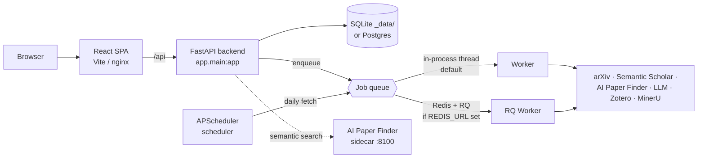

<!-- Language: **English** · [简体中文](./README.zh-CN.md) -->

**English** · [简体中文](./README.zh-CN.md)

# Auto-Researches Lite

**A self-hosted, single-user paper-discovery-and-trends tool with reading aids.** Point
it at a topic and it fetches papers from multiple sources, writes bilingual summaries,
analyzes research trends, and keeps everything in one local library you can chat with and
sync to Zotero — all on your own machine, and fully usable with **no API keys and no
external services**. No idea generation and no `claude`-CLI agent — just discovery,
trends, and reading aids.

> ### Looking for the full research pipeline?
> This edition is **discovery and trends only**, with reading aids. The hosted, advanced
> edition at **[autoresearches.com](https://autoresearches.com/)** adds **multi-user
> accounts**, **AI idea generation with baseline ranking**, **agentic (Channel B)
> `claude`-CLI steps**, the **experiment training-brief handoff** (idea →
> `PROJECT_BRIEF.md` you run on your own GPU), and **end-to-end LaTeX paper writing**. If
> you want the whole discover → idea → experiment → write loop as a managed service, start
> there.

---

## What it is

Auto-Researches Lite is the literature-discovery core of the Auto-Researches product,
repackaged to run **locally for one researcher**. There is no sign-up, no billing, and no
tenancy — the app boots as a single local user and every request acts as that user. It is
built to do one job well: help you **find, read, organize, and think about papers**.

- **Multi-source paper discovery** — arXiv, Semantic Scholar, and a semantic
  **AI Paper Finder** over a curated conference corpus. Papers accumulate across runs
  into a per-project library.
- **Bilingual summaries** — every paper gets an English and a 中文 summary, plus an
  optional code-repository analysis.
- **Research-trend analysis** — TF-IDF keyword trends and a word cloud over what you've
  collected.
- **Paper & project chat** — ask questions of a single paper or of the whole project,
  with the project context in scope.
- **Per-project context document** — auto-maintained after each step so later steps stay
  grounded in what came before.
- **Zotero sync** — push discovered papers into your Zotero library.
- **MinerU PDF parsing** — convert PDFs to clean Markdown for grounding (with an offline
  `pypdf` fallback).

Everything runs with **graceful degradation**: with zero configuration it uses a local
SQLite file, an in-process job queue, and a deterministic **mock LLM**, so the whole app
works offline. Add real provider keys later in the Settings page to upgrade the output —
no code changes, no restarts required.

## Features

| Capability | In this edition |
| --- | :---: |
| Projects | ✅ |
| Multi-source discovery (arXiv · Semantic Scholar · AI Paper Finder) | ✅ |
| Bilingual (EN / 中文) paper summaries | ✅ |
| Code-repository analysis per paper | ✅ |
| Research-trend analysis (TF-IDF + word cloud) | ✅ |
| Paper library that accumulates across runs | ✅ |
| Paper chat & project chat | ✅ |
| Per-project context document | ✅ |
| Zotero sync | ✅ |
| MinerU PDF parsing (offline `pypdf` fallback) | ✅ |
| Background jobs + scheduler + workers | ✅ |
| Channel A LLM service (provider API + mock fallback) | ✅ |
| Per-model reasoning-effort levels for Channel A | ✅ |
| Fernet-encrypted stored credentials | ✅ |
| Offline mock-LLM mode | ✅ |
| **AI idea generation with baseline ranking** | ❌ → [autoresearches.com](https://autoresearches.com/) |
| **Agentic (Channel B) `claude`-CLI steps** | ❌ → [autoresearches.com](https://autoresearches.com/) |
| **Multi-user accounts, login, roles** | ❌ → [autoresearches.com](https://autoresearches.com/) |
| **Billing, subscription tiers, quotas** | ❌ → [autoresearches.com](https://autoresearches.com/) |
| **Experiment stage (training-brief `PROJECT_BRIEF.md` handoff)** | ❌ → [autoresearches.com](https://autoresearches.com/) |
| **Paper writing stage (LaTeX drafts + figures)** | ❌ → [autoresearches.com](https://autoresearches.com/) |
| **Remote-GPU SSH handoff** | ❌ → [autoresearches.com](https://autoresearches.com/) |

The removed stages are not stubbed placeholders — this edition is deliberately scoped to
discovery, trends, and reading aids so it stays small, private, and easy to self-host.
The full pipeline — idea generation, agentic steps, experiments, and writing — lives at
**[autoresearches.com](https://autoresearches.com/)**.

## Architecture

A layered FastAPI backend, a background job system with an in-process fallback, and a
React SPA. Every external dependency has a local default, which is what makes the
zero-config boot possible.



| Layer | Tech |
| --- | --- |
| Backend | FastAPI + SQLAlchemy 2 — SQLite locally, optional Postgres |
| Jobs | In-process thread queue by default; optional Redis + RQ worker |
| Scheduler | APScheduler poller for per-project daily paper fetch |
| Frontend | React + Vite + TypeScript + Tailwind (served by nginx in Docker) |
| LLM — Channel A | Provider API (Anthropic / OpenAI …) for summaries, chat, and Zotero routing |

One LLM path: **Channel A** (`services/llm.py`) is the standard provider API used for
summaries, paper/project chat, and Zotero collection routing. It supports per-model
reasoning-effort levels and always falls back to a deterministic **mock LLM** on any
error, so a request never hard-fails. This edition ships **no Channel B** — the
non-interactive `claude`-CLI agent has been removed along with idea generation.

---

## Quickstart A — Docker Compose (recommended)

Runs the full stack (Postgres, Redis, backend, worker, scheduler, the AI Paper Finder
sidecar, and the nginx-served SPA) on your local machine.

```bash
cd deploy
cp .env.example ../.env          # then set JWT_SECRET once (see below)
docker compose up --build -d
```

Open **http://localhost:8080**. Every service is bound to `127.0.0.1` — nothing is
exposed to other machines.

**The only thing to set** in `../.env` is a stable secret:

```dotenv
# JWT_SECRET is the credential-encryption root. A key derived from it encrypts
# every secret you later enter in Settings. Set it ONCE and keep it stable —
# changing it makes previously stored secrets undecryptable.
JWT_SECRET=change-me-to-a-long-random-string      # openssl rand -hex 32
```

Everything else in `.env.example` (database URL, Redis URL, data path, frontend port,
worker concurrency, offline mode) has a working default and is only for advanced
overrides. **Provider API keys, MinerU, Zotero, and paper sources are configured in the
in-app Settings page, never in this file.**

The AI Paper Finder sidecar ships without its corpus. To enable semantic conference
search, populate its data volume once:

```bash
docker compose run --rm paperfinder bash download_data.sh
```

Custom host port: `FRONTEND_PORT=8088 docker compose up --build -d`, then open
`http://localhost:8088`.

## Quickstart B — Zero-config dev run

No Docker, no database, no keys. This runs the app **fully offline** with SQLite, the
in-process thread queue, and the deterministic mock LLM.

**Backend** (Python 3.11):

```bash
cd backend
uv venv --python 3.11 .venv && source .venv/bin/activate
uv pip install -e ".[dev]"
uvicorn app.main:app --reload        # API on http://localhost:8000, OpenAPI at /docs
```

**Frontend** (in a second shell):

```bash
cd frontend
npm install
npm run dev                          # http://localhost:5173, proxies /api → :8000
```

Open **http://localhost:5173**, create a project, and run discovery. There is no login —
the app auto-creates a single local user (`local@auto-researches.local`) and every request
acts as that user.

Run the test suite:

```bash
cd backend
pytest app/tests -q                  # full suite
pytest app/tests -m "not network" -q # skip the one test that hits the live arXiv API
```

`pytest` is the only automated backend check; the frontend is verified by `tsc -b` during
`npm run build`.

---

## Configuration — all in the Settings page

There are **no API keys in env files**. After first boot, open **Settings** in the app and
configure everything there. Stored secrets are encrypted at rest with a Fernet key derived
from `JWT_SECRET` (or a separate `CREDENTIAL_SECRET` if you set one).

| Setting | What it does |
| --- | --- |
| **LLM providers (Channel A)** | Provider API keys and the model catalog for summaries, chat, and Zotero routing, plus per-model **reasoning-effort** levels (`low` · `medium` · `high` · `xhigh` · `max`) that are probed per-level by the in-app model Test. |
| **MinerU** | Endpoint / token for PDF-to-Markdown parsing (falls back to offline `pypdf`). |
| **Zotero** | Library ID and API key for syncing discovered papers. |
| **Paper sources** | Enable/configure arXiv, Semantic Scholar, and the AI Paper Finder. |
| **Runtime knobs** | `worker_concurrency` — background-worker pool size (0 = use the `WORKER_CONCURRENCY` env default). |

With nothing configured, the app still works — it uses the mock LLM and offline fallbacks
so you can explore every screen before wiring up real providers.

## Job system & scheduler

- **One enqueue entrypoint.** All background work goes through a single submit call; task
  entrypoints take only a `job_id` and open their own DB session, which is what makes the
  in-process, thread, and Redis paths interchangeable.
- **In-process by default.** With no `REDIS_URL`, jobs run on a daemon thread inside the
  API process — no extra services to start.
- **Redis + RQ when you want scale.** Set `REDIS_URL` and run the worker
  (`python -m app.workers.run_worker`) to process jobs out-of-process; scale with
  `docker compose up -d --scale worker=N`.
- **Scheduler.** `python -m app.scheduler.run_scheduler` runs an APScheduler poller for
  per-project daily paper fetch. In Docker it runs as its own `scheduler` service.
- **Synchronous mode for tests.** `JOB_SYNC=1` runs jobs inline for deterministic runs.

## FAQ

**Does it really work with no API keys?**
Yes. With zero configuration the app boots on SQLite, an in-process job queue, and a
deterministic mock LLM. Real arXiv fetches and TF-IDF trend analysis work offline; only
the quality of LLM-generated summaries and chat improves once you add a provider key in
Settings.

**SQLite or Postgres?**
SQLite (a file under `_data/`) is the default and is fine for single-user local use. The
Docker Compose stack uses Postgres for durability; point `DATABASE_URL` at your own
Postgres if you prefer. Schema changes in this project are additive and nullable-safe, so
upgrades don't require destructive migrations.

**Is Redis required?**
No. Jobs run on an in-process thread by default. Set `REDIS_URL` only if you want an
out-of-process RQ worker (the Docker stack includes one).

**How do I update?**
`git pull`, then rebuild: for Docker, `cd deploy && docker compose up --build -d`; for the
dev setup, re-run `uv pip install -e ".[dev]"` and `npm install` if dependencies changed.
Keep `JWT_SECRET` stable across updates so stored secrets stay decryptable.

**Where's idea generation / the experiment / paper-writing stage?**
Not in this edition. This build is scoped to discovery, trends, and reading aids, so it
has no idea generation and no `claude`-CLI agent (Channel B). Use the hosted, advanced
edition at **[autoresearches.com](https://autoresearches.com/)** for AI idea generation
with baseline ranking, agentic steps, the experiment training-brief handoff, and full
LaTeX paper writing.

## Contributing

Contributions are welcome. A few conventions:

- **Verify before you PR.** Backend: `pytest app/tests -q`. Frontend: `npm run build`
  (which runs `tsc -b`). These are the only automated checks.
- **Keep the zero-config boot working.** The app must always boot with no environment
  variables (SQLite, in-process queue, mock LLM). Don't add a hard dependency on any
  external service.
- **New DB columns must be nullable-safe**, and output schemas must coerce `None`, so
  existing databases keep working after a pull.
- **UI strings are bilingual.** User-facing text uses the `t('English', '中文')` pattern —
  every new or edited string needs both languages.

## License

Released under the [MIT License](./LICENSE). Copyright (c) 2026 ycwfs.
