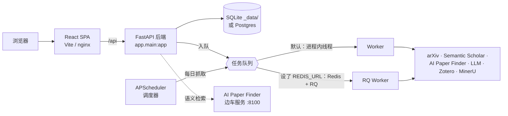

<!-- Language: [English](./README.md) · **简体中文** -->

[English](./README.md) · **简体中文**

# Auto-Researches Lite

**一个自托管、单用户、以文献发现与趋势为核心并带阅读辅助的工具。** 给定一个方向，它会从
多个来源抓取论文，生成中英双语摘要，分析研究趋势，并把这一切都存进一个本地文献库里——你
可以直接对论文提问，也能同步到 Zotero。整套系统在你自己的机器上运行，**无需任何 API Key、
无需任何外部服务** 也能完整使用。没有想法生成，也没有 `claude`-CLI 智能体——只做发现、趋势
与阅读辅助。

> ### 需要完整的科研流水线？
> 本版**只做文献发现与趋势**，并带阅读辅助。托管的进阶版 **[autoresearches.com](https://autoresearches.com/)**
> 额外提供 **多用户账户**、**带基线排序的 AI 想法生成**、**智能体（Channel B）`claude`-CLI
> 步骤**、**实验训练简报交接**（把想法转成 `PROJECT_BRIEF.md`，在你自己的 GPU 上运行）以及
> **端到端的 LaTeX 论文写作**。如果你想要完整的 发现 → 想法 → 实验 → 写作 闭环并以托管服务的
> 形式使用，请从那里开始。

---

## 这是什么

Auto-Researches Lite 是 Auto-Researches 产品中「文献发现」这一核心能力的重新打包，专为
**单个研究者本地运行** 而设计。没有注册、没有计费、没有多租户——应用启动即是一个本地用户，
每个请求都以该用户身份执行。它只把一件事做好：帮你 **发现、阅读、整理和思考论文**。

- **多源论文发现** —— arXiv、Semantic Scholar，以及在精选会议语料上做语义检索的
  **AI Paper Finder**。论文会跨多次运行持续沉淀进项目文献库。
- **双语摘要** —— 每篇论文都会生成英文与中文摘要，并可选做代码仓库分析。
- **研究趋势分析** —— 对已收集论文做 TF-IDF 关键词趋势统计并生成词云。
- **论文对话与项目对话** —— 既能针对单篇论文提问，也能带上项目上下文对整个项目提问。
- **项目上下文文档** —— 每一步之后自动维护，让后续步骤始终建立在已有结论之上。
- **Zotero 同步** —— 把发现的论文推送到你的 Zotero 文献库。
- **MinerU PDF 解析** —— 把 PDF 转成干净的 Markdown 作为上下文（离线时回退到 `pypdf`）。

整套系统采用 **优雅降级**：在零配置下使用本地 SQLite 文件、进程内任务队列和一个确定性的
**mock LLM**，因此完全离线也能跑通。之后在 Settings 页面填入真实的模型 Key 即可升级输出
质量——无需改代码，也无需重启。

## 功能一览

| 能力 | 本版是否包含 |
| --- | :---: |
| 项目管理 | ✅ |
| 多源发现（arXiv · Semantic Scholar · AI Paper Finder） | ✅ |
| 中英双语论文摘要 | ✅ |
| 逐篇代码仓库分析 | ✅ |
| 研究趋势分析（TF-IDF + 词云） | ✅ |
| 跨运行持续沉淀的文献库 | ✅ |
| 论文对话与项目对话 | ✅ |
| 项目上下文文档 | ✅ |
| Zotero 同步 | ✅ |
| MinerU PDF 解析（离线回退 `pypdf`） | ✅ |
| 后台任务 + 调度器 + Worker | ✅ |
| Channel A 模型服务（供应商 API + mock 回退） | ✅ |
| Channel A 按模型的推理强度等级 | ✅ |
| 存储凭据的 Fernet 加密 | ✅ |
| 离线 mock-LLM 模式 | ✅ |
| **带基线排序的 AI 想法生成** | ❌ → [autoresearches.com](https://autoresearches.com/) |
| **智能体（Channel B）`claude`-CLI 步骤** | ❌ → [autoresearches.com](https://autoresearches.com/) |
| **多用户账户、登录、角色** | ❌ → [autoresearches.com](https://autoresearches.com/) |
| **计费、订阅套餐、配额** | ❌ → [autoresearches.com](https://autoresearches.com/) |
| **实验阶段（训练简报 `PROJECT_BRIEF.md` 交接）** | ❌ → [autoresearches.com](https://autoresearches.com/) |
| **论文写作阶段（LaTeX 草稿 + 配图）** | ❌ → [autoresearches.com](https://autoresearches.com/) |
| **远程 GPU 的 SSH 交接** | ❌ → [autoresearches.com](https://autoresearches.com/) |

被移除的阶段并不是留空的占位——本版刻意把范围收敛在文献发现、趋势与阅读辅助，以保持轻量、
私密、易于自托管。完整流水线——想法生成、智能体步骤、实验与写作——在
**[autoresearches.com](https://autoresearches.com/)**。

## 架构

分层的 FastAPI 后端、带进程内回退的后台任务系统，以及一个 React 单页应用。每个外部依赖都有
本地默认实现，这正是零配置启动得以成立的原因。



| 层 | 技术 |
| --- | --- |
| 后端 | FastAPI + SQLAlchemy 2 —— 本地 SQLite，可选 Postgres |
| 任务 | 默认进程内线程队列；可选 Redis + RQ Worker |
| 调度 | APScheduler 轮询，负责各项目的每日论文抓取 |
| 前端 | React + Vite + TypeScript + Tailwind（Docker 中由 nginx 托管） |
| LLM — Channel A | 供应商 API（Anthropic / OpenAI …），用于摘要、对话与 Zotero 路由 |

只有一条 LLM 通路：**Channel A**（`services/llm.py`）是标准的供应商 API，用于摘要、论文/项目
对话以及 Zotero 分栏路由。它支持按模型设置推理强度，并在任何出错时都回退到确定性的
**mock LLM**，因此请求永远不会硬失败。本版**不含 Channel B**——非交互式 `claude`-CLI 智能体
已随想法生成一并移除。

---

## 快速开始 A —— Docker Compose（推荐）

在你本机跑起完整技术栈（Postgres、Redis、后端、Worker、调度器、AI Paper Finder 边车服务，
以及由 nginx 托管的前端）。

```bash
cd deploy
cp .env.example ../.env          # 然后设置一次 JWT_SECRET（见下）
docker compose up --build -d
```

打开 **http://localhost:8080**。所有服务都绑定在 `127.0.0.1`，不会暴露给其他机器。

`../.env` 里**唯一需要设置的**是一个稳定的密钥：

```dotenv
# JWT_SECRET 是凭据加密的根密钥：由它派生出的密钥会加密你之后在 Settings 中填入的所有密文。
# 只设置一次并保持稳定——一旦更改，之前存储的密文将无法解密。
JWT_SECRET=change-me-to-a-long-random-string      # openssl rand -hex 32
```

`.env.example` 中的其余项（数据库地址、Redis 地址、数据目录、前端端口、Worker 并发、离线
模式）都有可用默认值，仅用于高级覆盖。**模型 API Key、MinerU、Zotero、论文来源都在应用内的
Settings 页面配置，绝不写进这个文件。**

AI Paper Finder 边车服务默认不含语料。要启用会议语义检索，先给它的数据卷灌一次数据：

```bash
docker compose run --rm paperfinder bash download_data.sh
```

自定义主机端口：`FRONTEND_PORT=8088 docker compose up --build -d`，然后打开
`http://localhost:8088`。

## 快速开始 B —— 零配置开发运行

不用 Docker、不用数据库、不用任何 Key。这种方式用 SQLite、进程内线程队列和确定性的 mock LLM
**完全离线** 跑起整个应用。

**后端**（Python 3.11）：

```bash
cd backend
uv venv --python 3.11 .venv && source .venv/bin/activate
uv pip install -e ".[dev]"
uvicorn app.main:app --reload        # API 在 http://localhost:8000，OpenAPI 在 /docs
```

**前端**（另开一个终端）：

```bash
cd frontend
npm install
npm run dev                          # http://localhost:5173，把 /api 代理到 :8000
```

打开 **http://localhost:5173**，创建一个项目并运行发现。没有登录——应用会自动创建一个本地
用户（`local@auto-researches.local`），每个请求都以该用户身份执行。

运行测试：

```bash
cd backend
pytest app/tests -q                  # 完整测试
pytest app/tests -m "not network" -q # 跳过唯一一个访问 arXiv 线上 API 的测试
```

`pytest` 是后端唯一的自动化检查；前端由 `npm run build` 中的 `tsc -b` 负责校验。

---

## 配置 —— 全部在 Settings 页面

**env 文件里没有任何 API Key。** 首次启动后，打开应用内的 **Settings** 页面在那里配置一切。
存储的密文会用由 `JWT_SECRET`（或你另设的 `CREDENTIAL_SECRET`）派生的 Fernet 密钥静态加密。

| 配置项 | 作用 |
| --- | --- |
| **模型供应商（Channel A）** | 供应商 API Key 与模型目录，用于摘要、对话与 Zotero 路由，并可按模型设置**推理强度**等级（`low` · `medium` · `high` · `xhigh` · `max`），由应用内的模型 Test 按每个等级逐一探测。 |
| **MinerU** | PDF 转 Markdown 的服务地址 / Token（离线时回退 `pypdf`）。 |
| **Zotero** | 用于同步论文的 Library ID 与 API Key。 |
| **论文来源** | 启用并配置 arXiv、Semantic Scholar 和 AI Paper Finder。 |
| **运行时参数** | `worker_concurrency` —— 后台 Worker 并发池大小（0 = 使用 `WORKER_CONCURRENCY` 环境变量默认值）。 |

什么都不配置也能用——应用会走 mock LLM 和离线回退，让你在接入真实供应商之前就能把每个页面
都点一遍。

## 任务系统与调度器

- **单一入队入口。** 所有后台工作都走同一个 submit 入口；任务入口只接收一个 `job_id` 并自行
  打开数据库会话，这正是进程内、线程、Redis 三条路径可互换的原因。
- **默认进程内。** 未设 `REDIS_URL` 时，任务在 API 进程内的守护线程上运行——无需额外启动任何
  服务。
- **要扩展就上 Redis + RQ。** 设置 `REDIS_URL` 并运行 Worker
  （`python -m app.workers.run_worker`）即可把任务放到进程外执行；用
  `docker compose up -d --scale worker=N` 横向扩展。
- **调度器。** `python -m app.scheduler.run_scheduler` 运行一个 APScheduler 轮询器，负责各
  项目的每日论文抓取。在 Docker 中它作为独立的 `scheduler` 服务运行。
- **测试用同步模式。** `JOB_SYNC=1` 让任务内联执行，便于得到确定性结果。

## 常见问题

**真的不用任何 API Key 就能用？**
是的。零配置下应用基于 SQLite、进程内任务队列和一个确定性的 mock LLM 启动。真实的 arXiv 抓取
和 TF-IDF 趋势分析离线也能工作；只有 LLM 生成的摘要与对话质量，会在你于 Settings 中填入
供应商 Key 后提升。

**用 SQLite 还是 Postgres？**
默认是 SQLite（`_data/` 下的一个文件），对单用户本地使用完全够用。Docker Compose 技术栈为了
持久性使用 Postgres；如果你愿意，也可以把 `DATABASE_URL` 指向自己的 Postgres。本项目的表结构
改动都是「新增且可空」的，因此升级不需要破坏性迁移。

**必须要 Redis 吗？**
不必。任务默认在进程内线程上运行。只有当你想要进程外的 RQ Worker 时才设置 `REDIS_URL`
（Docker 技术栈已自带一个）。

**如何更新？**
`git pull`，然后重建：Docker 方式执行 `cd deploy && docker compose up --build -d`；开发方式
在依赖变化时重跑 `uv pip install -e ".[dev]"` 和 `npm install`。更新时请保持 `JWT_SECRET`
不变，以确保存储的密文仍可解密。

**想法生成 / 实验 / 论文写作阶段在哪？**
不在本版中。本版把范围收敛在文献发现、趋势与阅读辅助，因此没有想法生成，也没有 `claude`-CLI
智能体（Channel B）。请使用托管的进阶版 **[autoresearches.com](https://autoresearches.com/)**
来获得带基线排序的 AI 想法生成、智能体步骤、实验训练简报交接和完整的 LaTeX 论文写作。

## 参与贡献

欢迎贡献。几条约定：

- **提 PR 前先验证。** 后端：`pytest app/tests -q`。前端：`npm run build`（会跑 `tsc -b`）。
  这是仅有的两项自动化检查。
- **保持零配置可启动。** 应用必须在没有任何环境变量时也能启动（SQLite、进程内队列、mock
  LLM）。不要引入对任何外部服务的硬依赖。
- **新增数据库列必须可空**，且输出 schema 要把 `None` 归一化处理，这样旧数据库在 `git pull`
  之后仍能正常工作。
- **界面文案是双语的。** 面向用户的文本使用 `t('English', '中文')` 模式——每一条新增或修改的
  文案都要同时给出两种语言。

## 许可证

以 [MIT License](./LICENSE) 发布。Copyright (c) 2026 ycwfs。
